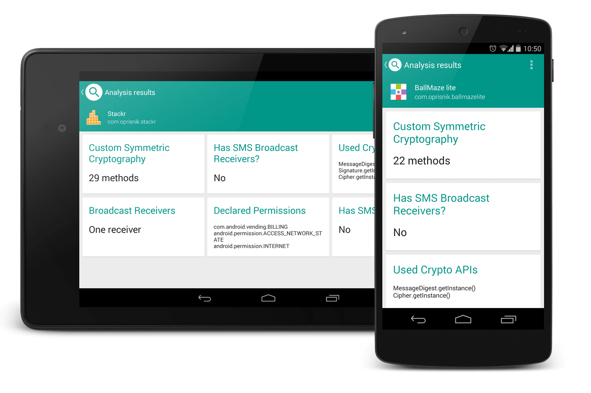

# Semdroid

Semdroid is a static Android application analysis framework.
It employs several different analysis plugins that are capable of assessing an application's functionality.
Semdroid can be used on your local computer via a command line interface, directly on your Android
device or as a server.

With Semdroid you can

* Detect custom symmetric cryptography
* Detect custom asymmetric cryptography
* Detect SMS broadcast receivers
* See where certain API calls are used
* And much more

You can also add your own plugins.
See [PLUGINS.md](doc/PLUGINS.md) for more information.

## Try Semdroid

### Android application

With the Semdroid Android application, you can see what the applications you've installed on your device can do.

### Server

The Semdroid server can be found at http://semdroid.oprisnik.com/server

Just upload an .apk file and get the analysis results.

## More information

* [Building Semdroid](doc/BUILDING.md)

* [Adding new plugins](doc/PLUGINS.md)

* [Even more information](http://semdroid.oprisnik.com)

## Copyright

    Copyright 2014 Alexander Oprisnik

    Licensed under the Apache License, Version 2.0 (the "License");
    you may not use this file except in compliance with the License.
    You may obtain a copy of the License at

       http://www.apache.org/licenses/LICENSE-2.0

    Unless required by applicable law or agreed to in writing, software
    distributed under the License is distributed on an "AS IS" BASIS,
    WITHOUT WARRANTIES OR CONDITIONS OF ANY KIND, either express or implied.
    See the License for the specific language governing permissions and
    limitations under the License.